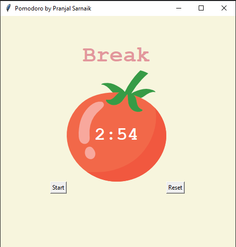
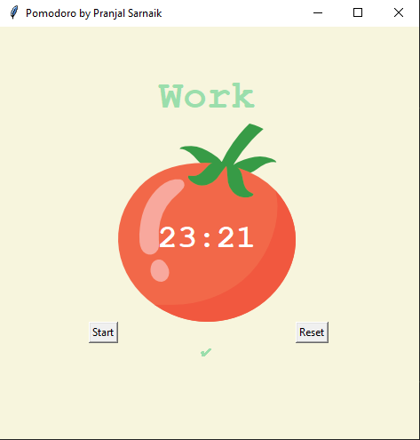

# Pomodoro
The Pomodoro Timer is a productivity app with a **Tkinter**-based UI that helps users follow the Pomodoro technique. It includes a countdown timer, session indicators, and automatic work/break transitions. 

## Screenshots
, 

## Author
Pranjal Sarnaik

## Features
- Dynamic GUI with status labels, timer, and tick marks.  
- Easy-to-use **Start** and **Reset** buttons.  
- Automatically switches between Work, Short Break, and Long Break sessions.  
- Tracks completed cycles with visual ticks.  

## Level
Intermediate

## Tech Stack
Python | Tkinter | Timer Logic | GUI Development | Event-Driven Programming  

## How to Run
1. Clone the repo:  
   ```bash  
   git clone https://github.com/pranjalco/pomodoro-intermediate.git

3. Run:
    ```bash  
   python app.py

**Created by Pranjal Sarnaik**  
*Released under the MIT License*